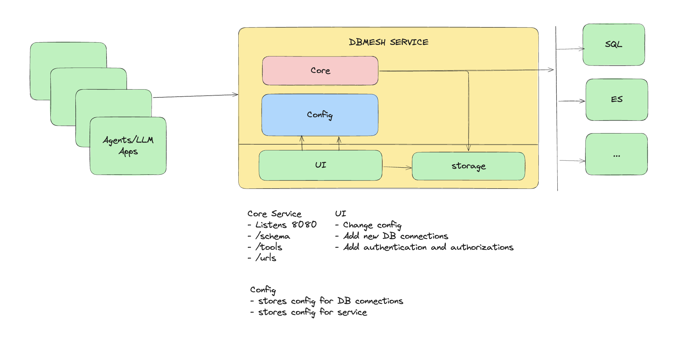

# MCP Mesh - WIP


A middleware solution designed to seamlessly connect Large Language Model (LLM) applications and AI Agents with databases using the Model Context Protocol. DB Mesh acts as an intelligent intermediary layer that facilitates secure and efficient database interactions while maintaining context awareness. Key features include:

- Easy configuration through YAML files and environment variables
- Fine-grained access control and permission management
- Intellegent service that creates custom tools based on the database it connects to.

## Overview

DB Mesh provides:
- Seamless integration between LLM applications and various database systems
- Implementation of Model Context Protocol for structured data interactions
- Security and access control layer for database operations
- Context-aware query handling and optimization
- Support for multiple database types and configurations

## Default Configuration

When the application starts for the first time, it will create a default configuration file with the following structure:

```yaml
databases:
  postgres:
    name: dbmesh_main
    type: postgres
    host: localhost
    port: 5432
    username: postgres
    password: password123
    database: dbmesh_main
```

## Security Considerations

- The configuration file contains sensitive information. Make sure it is not committed to version control.
- Consider using environment variables for sensitive values in production environments.
- The default configuration is for development purposes only. Always change the default password in production. 
